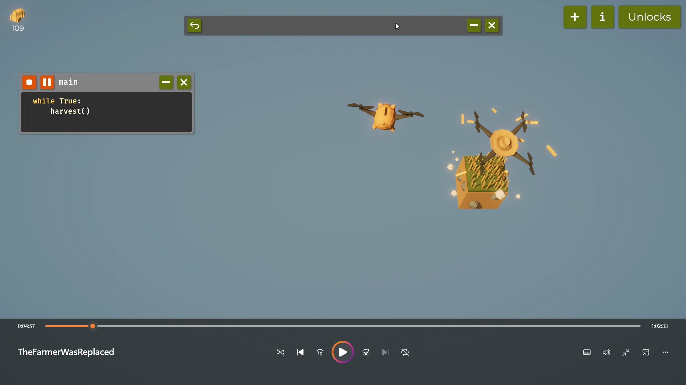
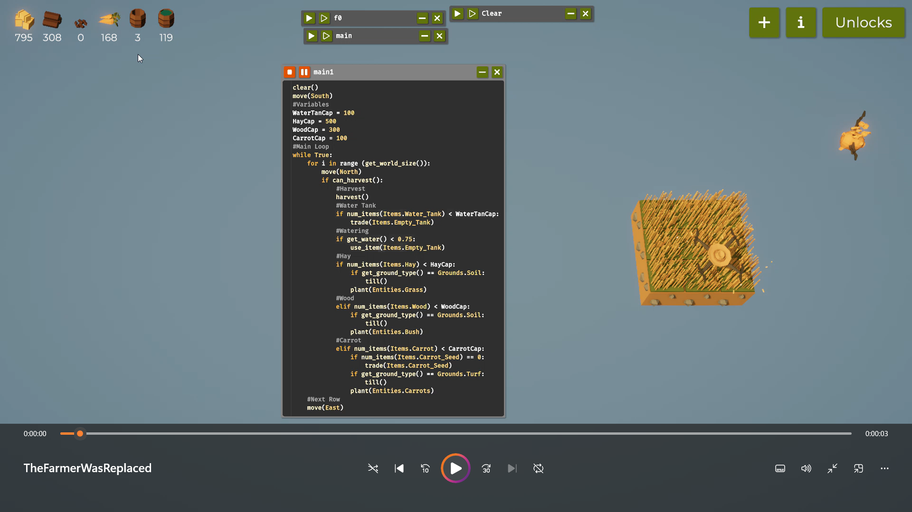

# Programming the Farming Drone(Report)

## introduction
This farming drone game is designed to model tasks related to farming, using drones for automation of crop monitoring and maintenance. The goal of this game is to program a drone for basic farm-related tasks such as planting seeds, watering crops, spreading fertilizer, and detecting pests-all with a minimum amount of human intervention.
Players write code or set up commands that control the movement and actions of the drone across a virtual farm field. With proper programming, players can optimize crop yields, reduce resource waste, and keep crops healthy. Success in this game is achieved when the players make sure that the drone executes the tasks in due time with efficiency to simulate the real-world practice of precision agriculture.
This is an incredibly interactive game of learning drone automation in agriculture, whereby one gets to develop problem-solving skills, learns how to code, and sees the effect of technology on farming.

# Table of Contents
-[Code Snippets and Explanation](#code-snippets-and-explanation)
-[Challenges and Learnings](#challenges-and-learnings)
-[References](#references)

# Code-Snippets-and-Explanation
Write and Explain your code along with recordings.

## Step 1:Farming on 1 tile

**Code:**

...
while True:
 if can_harvest():
   harvest()
...

**Exxplanation**

while True:
This line starts an infinite loop. The loop will keep running until it’s manually stopped or interrupted, as True is always true, so the loop condition never fails.

if can_harvest():
Inside the loop, this line checks a condition using the can_harvest() function.
The can_harvest() function presumably returns True if there are crops ready for harvesting and False otherwise.
If can_harvest() is True, the code will proceed to the next line; otherwise, it skips to the next iteration of the loop.

harvest()
If can_harvest() is True, this line calls the harvest() function, which likely performs the harvesting action on the ready crops.

**Demo**
Video Demo:

**Note**
The code provides a foundational understanding of how to automate a process, make decisions based on conditions, and use functions to organize tasks. It’s a great starting point for creating more complex systems that require constant monitoring and immediate responses.

## Step 2: Farming on 3*3 tile

**Code:**

...python
while True:
 #Code to go around
 if can_harvest():
   harvest()
...

**Explanation**
while True: creates an infinite loop, meaning the code inside will repeat endlessly.
if can_harvest(): checks if crops or items are ready to harvest.
harvest() performs the harvest action if the condition is met.

**Demo**
Video Demo:

**Notes**
Crop Auto-pickup: The code enables the agent to patrol the field at all instances and at every place for the crops that may be ready to get harvested. When the code identifies a ready crop, it harvests the same automatically.

Resource Optimization: With time, the agent covers a big area; thus, no crop that is supposed to be harvested may escape the agent for better yield.

Reduced Manual Effort: Players or users will not have to go manually check on the status of each crop. Instead, the agent does that continuously, while they may do other things.

Scalability: This structure of code can easily be scaled up to include multiple agents or larger fields, by programmatically adding movement patterns or expanding the search area.

# Challenges and Learning

## Challenges
- Navigation and Path Finding: This would help the drone navigate around the     farm efficiently without, for example, getting stuck on obstacles like trees or rocks. It would need the implementation of reliable pathfinding algorithms in order for the drone not to waste time or energy but cover all the required areas.
Identification of harvestable crops: this can_harvest() function of the code relies on correct identification of the ripe crop. Such detection may be tricky since, depending on the sensors or image recognition that needs to be performed, it needs to be robust across a range of different lighting and environmental conditions.
Minimize crop damage: During harvesting, to avoid damage to the other plants, the drone should be controlled precisely. This would entail proper calibration of the movement and harvest mechanisms.

-The Path Planning Algorithms: Minimize time between crops with A* algorithms for faster harvesting.
Sensor Integration: Advanced sensors assess crop readiness for ripe crop picking. GPS and LIDAR are enabled for precision navigation.
Machine Learning: Run models to predict ideal timings of harvests based on variables in the environment to fine-tune real-time decisions.
Energy Management: Other than task scheduling, optimize energy levels and use efficient flight patterns to utilize batteries efficiently.
Real-Time Data Analytics: Real-time monitoring of the progress and making immediate adjustments to the operations accordingly.
Simulation and Testing: Run simulations to identify bottlenecks and test strategies prior to deployment in the field.
User Interface Optimization: Develop a user-friendly interface for easy programming and monitoring.

## Learning
Pathfinding Algorithms: Develop an A* and Dijkstra's Algorithm as pathfinding algorithms to be implemented on a grid to perform route planning. The drone, with the help of these algorithms, should be able to navigate around obstacles to the shortest paths.
Greedy Algorithms: Adhere to greedy practices in order to constantly choose the closest crop to harvest, which will maximize immediate decisions.
Dynamic Programming: Divide complicated problems into simpler sub-problems for those tasks that require multiple drones to coordinate with each other or optimize their routes.
Machine Learning Algorithms: Employ techniques of classification and regression-based prediction of the readiness of certain crops using historical data.
Optimization Techniques: Employ genetic algorithms or simulated annealing in route optimization and task scheduling of drones.
Grid Navigation: Tile-to-tile navigation algorithms for drones so that the ground is covered without wastage.
Data Structure: Trees, graphs, and grass for efficient representation of the state of drones and pending tasks.
Control Algorithms: The use of PID controllers would maintain stability and accuracy in the movements the drone makes.
Simulation Algorithms: These are algorithms used in modeling and simulation to test the efficiency of the drone's mode of operation in different agricultural scenarios.

## Reference
1. https://youtu.be/gmJ357XAAdE?si=MmWmEcvlt0eAAVBv
2. https://youtu.be/gmJ357XAAdE?si=bVOwJeYX6QqAXeGF